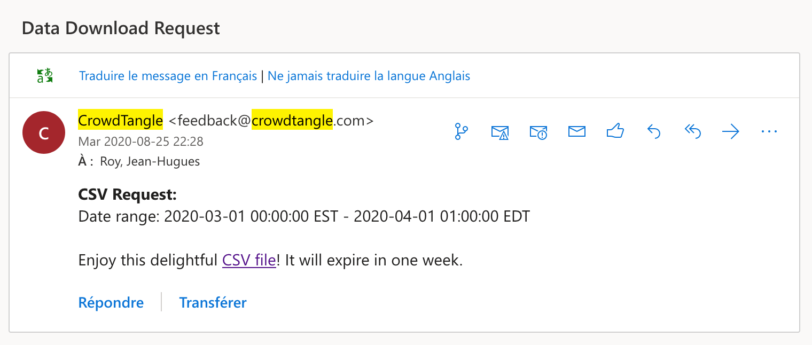

# facebook-canada
#### Analyse des contenus journalistiques dans Facebook (sur deux ans et demi: du 1er janvier 2018 au 30 juin 2020)


Pour ce texte dans [La conversation](), j'ai procédé à une extraction puis une analyse de données dont je donne la méthodologie détaillé ci-dessous.

### Étape 1 - Extraction

J'ai utilisé [CrowdTangle](https://www.crowdtangle.com/), un outil de détection de contenu viral fourni par Facebook. Son interface de recherche permet, si on s'intéresse aux pages Facebook, par exemple, de demander les 30 000 publications les plus populaires dans un pays donné et au cours d'une période qu'on peut définir.

Je m'intéresse à la période débutant le 1er janvier 2018 jusqu'au 30 juin 2020. Je pourrais demander les 30 000 publications canadiennes les plus populaires sur toute cette période. Un échantillon de n = 30k est intéressant. Mais si je demande les 30 000 publications les plus populaire pour chacun des 30 mois sur la période visée, mon échantillon passe alors à 900k, ce qui est plus costaud.

À partir du menu de recherche de CrowdTangle, donc, j'ai fait 30 requêtes pour chacun des mois entre le 1er janvier 2018 et le 30 juin 2020. À chaque fois, j'ai reçu un courriel me prévenant qu'un _délectable_ fichier CSV m'attendait.



Ici, j'aurais dû vous donner un lien vers chacun des 30 fichiers que j'ai reçus afin de vous permettre de refaire ma démarche. J'essaie de faire de la recherche ouverte. La transparence est fondamentale pour moi, comme l'illustrent mes autres répertoires sur github.

Mais je me rends compte que je n'ai malheureusement pas le droit de partager publiquement les données que j'ai obtenues par le biais de cet outil si on lit attentivement [les conditions d'utilisation de CrowdTangle](https://www.crowdtangle.com/terms/), plus particulièrement son article III.7:

> *«You may not display Content from CrowdTangle as any sort of public-facing display, app, product or otherwise external format without the express written consent of CrowdTangle.»*

#### Il me fera cependant plaisir de les partager avec [tout chercheur ou journaliste qui m'en fera la demande](mailto:roy.jean-hugues@uqam.ca).

Je vous donne tout de même une idée des informations auxquelles CrowdTangle donne accès en vous présentant les entêtes de colonnes et la première ligne du fichier reçu pour avril 2020 (je n'ai conservé que le début de certains textes pour respecter les conditions d'utilisation):

|Page Name|User Name|Facebook Id|Likes at Posting|Created|Type|Likes|Comments|Shares|Love|Wow|Haha|Sad|Angry|Care|Video Share Status|Post Views|Total Views|Total Views For All Crossposts|Video Length|URL|Message|Link|Final Link|Image Text|Link Text|Description|Sponsor Id|Sponsor Name|Total Interactions|Total Interactions (weighted  —  Likes 1x Shares 1x Comments 1x Love 1x Wow 1x Haha 1x Sad 1x Angry 1x Care 1x )|
|-----|-----|-----|----:|-----|-----|----:|----:|----:|----:|----:|----:|----:|----:|----:|-----|----:|----:|----:|-----|-----|-----|-----|-----|-----|-----|-----|-----|-----|-----|-----|
|Dad Patrol|HiveMediaTeamDadPatrol|161042861038324|460935|2020-04-16 09:48:29 EDT|Link|1264351|8700|25716|491805|3971|1948|127107|251|48199||0|0|0|N/A|https://www.facebook.com/HiveMediaTeamDadPatrol/posts/858090351333568|Because [...]|https://www.dadpatrol.com/bat-dad/pictures-of-smiling-preemie-babies-that-warm-our-hearts/?utm_source=ot&utm_campaign=eby-dm-na-n-0-dapa-200416-dp-ot-d1&utm_medium=blank&utm_content=blank&utm_term=blank|||Pictures [...]|"These premature babies [...]"|||"1,972,048"|"1,972,048"|

### Étape 2 - Nettoyage

À l'aide du script [**ctcan1.py**](ctcan1.py), j'ai ensuite combiné ces 30 fichiers tout en faisant au passage trois opérations:
- une vérification pour repérer d'éventuels doublons
- une réduction de l'URL de la publication pour n'en conserver que le «postID», numéro d'identification unique de chaque publication
- un réorganisation de certaines colonnes

J'obtenais un seul fichier de 899 999 lignes dont voici un exemple de la première ligne, avec des entêtes (ici encore, je n'ai conservé que le début de certains éléments textuels):

|page|code|fbID|pageLikes|date|annee|mois|jour|postID|message|texteImage|texteLien|desc|sponsor|sponsorID|typePost|statutVideo|dureeVideo|vuesPost|vuesTotal|vuesTotalCrossposts|partages|likes|love|wow|haha|triste|colere|solid|commentaires|interactions|
|-----|-----|-----|----:|-----|----:|----:|----:|-----|-----|-----|-----|-----|-----|-----|-----|-----|-----|----:|----:|----:|----:|----:|----:|----:|----:|----:|----:|----:|----:|----:|
|The Daily Goalcast|dailygoalcast|1339965909481783|1485902|2019-03-08|2019|03|08|1339965909481783_1642750622536642|"She [...]"||This is [...]||||Native Video|crosspost|00:04:15|4913515|51905318|54315632|1169353|112777|50399|2783|495|12332|467|11|14466|1363083|

### Étape 3 - Identification des pages journalistiques

En faisant un tableau croisé dynamique	dans le fichier résultant de l'étape 2, j'ai obtenu une liste des quelque 13 018 pages ayant au moins un _post_ parmi les 899 999 plus populaires sur Facebook au Canada depuis le 1er janvier 2018.

À partir de cette liste, j'ai ajouté une colonne pour identifier, manuellement, les pages appartenant à des médias d'information. Mes critères étaient simples: il faut que ce soient des médias où j'accepterais que les étudiant.e.s en journalisme de l'UQAM puissent [faire un stage](journalisme.uqam.ca/stages/).

J'ai donc conservé:
- Les grands médias reconnus:
	- quotidiens (comme le _Toronto Star_ ou _Le Soleil_)
	- réseaux d'information télé (comme _TVA Nouvelles_ ou _CBC News_)
	- magazines d'information (comme _Maclean's_)
	- radios parlées (comme le _104,7 Outaouais_ ou _680 News_)
	- ainsi que:
		- leurs pages thématiques (comme _Radio-Canada Science_ ou _Le sac de chips_) et
		- régionales (comme _Global Edmonton_ ou _Téléjournal Acadie_)
- Les hebdomadaires régionaux et de quartier (comme _The Coast, Halifax's Weekly_ ou _IDS - Verdun Hebdo_)
- Les stations de télé locales (comme _CIMT Nouvelles_), ainsi que
- Les sites web d'information hyper-locaux (comme _Daily Hive Toronto_)
- Les médias d'information spécialisée (comme _The Score_ ou _Québec Science_)

Ce qui exclut:
- Des médias d'opinion (comme _Rebel News_ ou _Epochtimes Vancouver_, par exemples)
- Des magazines de vedettes, «people» ou focalisant exclusivement sur le «lifestyle»)
- Des sites qui calquent leur format sur des sites d'information pour faire la promotion de marques et de partis politiques (comme _Ontario News Now_, par exemple)
- Des pages de journalistes individuel (comme _Sophie Thibault_ ou	_Scott Miller CTV_)
- Des pages destinées à faire la promotion de médias, ou qui ne sont pas consacrées à l'information (comme _CBC Comedy_ ou _Global TV_)
- Des stations de radio musicales (les réseaux Virgin, Red, Fly, myFM, Rouge, Boom, etc.)
- Des sites faisant de la satire d'information (comme _The Burrard Street Journal_)
- Des sites viraux (comme tous ceux qui sont produits par Valnet, par exemple), car leur but premier est de générer des clics et non d'informer.

Il y en a 495. J'en ai peut-être omis. Mais je crois que les plus importants sont identifiés. Cette liste, je peux la partager. Il s'agit du fichier [**pages-canada.csv**](pages-canada.csv).

Vous remarquerez que plusieurs pages traitent de sujets qui n'ont rien à voir avec les Canadiens, comme [Kajal Agarwal FC](https://www.facebook.com/imkajufan/), le fan club d'une actrice de Bollywood qui a plus de 5 millions d'abonnés! Même la page Facebook indique que l'adresse du club se trouve à Hyderabad. Mais cinq de ses administrateurs sont au Canada et deux en Inde. Pour Facebook, c'est donc une page canadienne. Faire le tri de plus de 13 000 pages Facebook serait beaucoup trop fastidieux; j'ai donc conservé la classification par pays de Facebook, même si elle est imparfaite. Cela signifie peut-être que la part des médias dans les pages Facebook canadiennes

### Étape 4 - Détermination de la langue

Pour calculer la place de l'information dans l'espace francophone ou anglophone au Canada, il fallait déterminer la langue principale des 13 000 pages Facebook incluses dans mon extraction de données.

C'est ce que fait le script [**langues.py**](langues.py) au moyen de trois bibliothèques python ([langdetect](https://pypi.org/project/langdetect/), [langid](https://pypi.org/project/langid/) et [polyglot](https://polyglot.readthedocs.io/en/latest/Installation.html)) pour examiner chacun des 899 999 posts pour en détecter la langue. Si deux ou trois bibliothèques s’entendent sur une langue donnée, le post est réputé être dans cette langue, sinon la langue est classée comme «inconnue» (à noter que ce script indiquait aussi si chaque post était issu d'une page d'information journalistique ou non).

Dans un premier temps, plus de 130 000 publications (près de 15% du total) étaient classées comme étant rédigées dans une langue inconnue. Souvent, il s'agissait de posts composés uniquement d'un ou de quelques emojis, ou encore d'images dont le texte n'avait pas pu être extrait.

À la suggestion de [Naël Shiab](http://naelshiab.com/), à qui j'ai demandé d'examiner ma méthodologie, mes données et mes scripts, j'ai regardé, pour chaque post dont la langue est inconnue, quelle page l'a publié et de lui attribuer la langue dans laquelle la majorité des posts de cette page sont rédigés.

J'ai donc fait un tableau croisé dynamique sur le fichier résultant du script **langues.py** à l'aide de [Pandas](https://pandas.pydata.org/pandas-docs/stable/reference/api/pandas.pivot_table.html). Cette opération a nécessité un autre script, très court: [**langues2.py**](langues2.py).

Ensuite, à l'aide d'une formule qui combine les fonctions ```max()```, ```index()``` et ```equiv()```, j'ai déterminé la langue la plus courante dans les pages comptant au moins un post dont la langue avait été classée comme «inconnue». Le résultat se trouve dans le fichier [**langues-inconnues.csv**](langues-inconnues.csv).

Après cette opération, le nombre de posts dont la langue est inconnue est tombé à 849, ce qui est moins de 0,1% de l'ensemble.

### Étape 5 - Analyse finale

Le fichier résultant de l'étape 4 a enfin été analysé à l'aide de pandas. Le carnet [**Canada.ipynb**](Canada.ipynb) vous donne l'essentiel des opérations effectuées pour déterminer la place de l'information dans les pages Facebook publiées en français et en anglais au Canada.

Le fichier [**bilan.csv**](bilan.csv) présente le résultat de cette analyse. Il donne, par type de post (issu d'une page qui fait de l'information journalistique ou non) et par langue:
- le nombre de posts
- la somme des interactions suscitées
- une moyenne du nombre d'interactions par post.

### FAQ sur les limites de cette étude

_Pourquoi me suis-je seulement intéressé aux **pages** Facebook?_

Parce qu'il n'est pas possible de filtrer par pays si on s'intéresse au contenu publié dans des groupes Facebook, sur des profils Facebook, sur Instagram ou d'autres réseaux sociaux couverts par CrowdTangle (Twitter et Reddit). C'est pour cela que j'ai dû limiter mon analyse aux pages.

_Les pages Facebook suffisent-elles pour dire tout ce qui est «consommé» sur Facebook?_

Non. Cette analyse ne peut pas, pour les raisons expliquées ci-dessus, inclure le contenu publié sur les groupes ou les profils Facebook, ni sur Instagram. On doit donc assumer que la proportion du contenu sur ces autres «produits» de Facebook doit ressembler à ce qu'on peut calculer sur les pages. C'est le mieux que l'on puisse faire avec les données fournies par Facebook.

_Comment CrowdTangle fait-il pour déterminer qu'une page est originaire d'un pays X ou Y?_

L'outil se sert des personnes qui administrent la page. Quand une page génère beaucoup d'achalandage, normalement, elle est gérée par toute une équipe. Certaines pages comptent jusqu'à une vingtaine d'administrateurs qui peuvent travailler de plusieurs pays différents (classiquement, à part le Canada, je voyais les États-Unis, le Royaumne-Uni, l'Inde, le Pakistan, la France, le Maroc). Le pays avec le plus d'administrateurs est le pays où cette page est réputée être basée. Il n'est pas nécessaire que les administrateurs canadiens forment la majorité pour que la page soit canadienne. Il peut arriver qu'il y a 8 administrateurs dans 7 pays différents, un par pays sauf le Canada qui en compte deux: boum! C'est réglé! La page est canadienne. :canada:

_Pourquoi n'avoir recueilli que 30 000 pages par mois?_

La limite de 30 000 résultats pour une requête donnée est une limite de l'outil CrowdTangle. Je me suis par ailleurs limité à une cueillette **par mois** pour des raisons pratiques. Choisir une granularité plus fine aurait demandé plus de temps. Demander les 30 000 publications les plus populaires **par semaine** aurait exigé 130 requêtes et aurait retourné près de 4 millions de posts dans 130 fichiers csv. Demander les 30 000 publications les plus populaires **par jour** aurait demandé 912 requêtes et retourné jusqu'à 27 millions de publications.

_Si je me vante de savoir programmer, pourquoi avoir procédé **manuellement** à ma collecte de données plutôt que programmatiquement?_

CrowdTangle dispose d'un [API](https://github.com/CrowdTangle/API/wiki/). Mais son [point d'accès _Search_](https://github.com/CrowdTangle/API/wiki/Search) n'est accessible que si on en fait la demande. Je n'y avait pas accès lorsque j'ai effectué ma collecte de données. J'y ai eu accès début septembre 2020. Mais l'API de CrowdTangle a des limites: six appels à la minute seulement et chaque appel ne retourne que 100 publications. C'est ainsi que de demander les 30 000 publications les plus populaires par jour demanderait à un script de rouler sans arrêt pendant plus de 31 jours! J'ai commencé à le faire. L'API, parfois, n'est pas accessible et le script plante régulièrement. Ça prendra assurément plus de 31 jours!! Je vais donc me contenter de mes 30 000 posts par mois.
